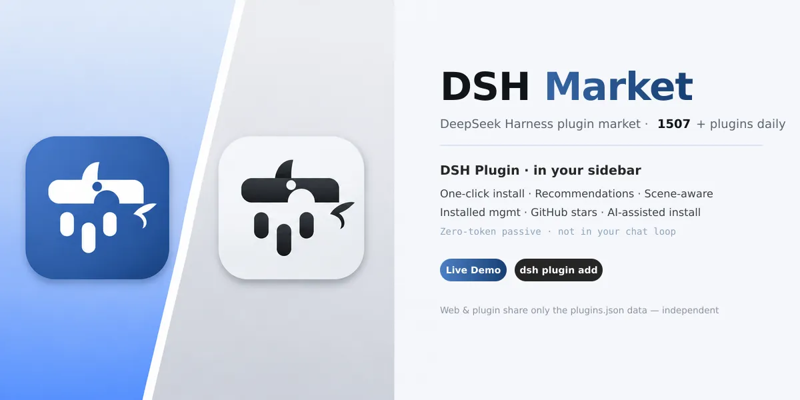
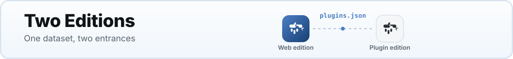
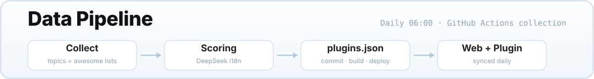

<p align="center">
  <b><a href="./README.md">中文</a></b> · <b>English</b>
</p>

<p align="center">
  
</p>

<div align="center">

[](https://dsh.market/)
[](https://github.com/2BingLing/dsh-market/issues/new?template=submit_plugin.md)
[](https://github.com/2BingLing/dsh-market/blob/main/LICENSE)
[](https://dsh.market/)
[](https://github.com/2BingLing/dsh-market/actions)

</div>

---

## Two Editions

<p align="center">
  
</p>

The DSH ecosystem is growing fast, and plugins are scattered across GitHub — **it's hard to know which ones are good and how to install them**. DSH Market gathers them all in one place and offers two ways to consume them:

| |  **Web edition** (Live) |  **DSH plugin edition** (Done) |
|---|---|---|
| **Where** | Browser · GitHub Pages static site | DSH sidebar · cordis plugin |
| **Role** | Discover & evaluate | Install & manage |
| **Core** | Chinese search · 5-dimension radar chart · Curated/New sections · Cold-start quiz · Real install commands on detail pages | 5-tab panel · **One-click install** (skill/cordis routing, retry + rollback) · **For-you picks** (profile-based) · **Scene recommendations** (reads session context) · **Installed management** (detect/uninstall) · **GitHub starring** (PAT) · **AI-assisted install** (subagent verifies README, then installs) |
| **Install** | Zero install, open in your browser | `dsh plugin --profile web add dsh-market` |
| **Resources** | — | Zero-token passive, never in daily conversations |

> **The two editions share only the same `plugins.json` data** (refreshed daily at 06:00 with stars & descriptions) — nothing else. The Web site is a standalone browsing site; the plugin is a standalone cordis plugin. They are independent and optional: **you don't need the plugin to use the Web edition, and installing the plugin doesn't affect the Web site**.

## Demo

| Web edition | DSH plugin edition |
|---|---|
|  |  |

## Quick Start

### Web edition

No install needed, just visit:

<https://dsh.market/>

### DSH plugin edition

```bash
dsh plugin --profile web add dsh-market
```

**Restart the harness** after installing — the "Plugin Market" entry appears at the bottom of the sidebar.

## Features

- **Continuous collection** — scans `dsh-plugin` / `dsh` GitHub topics and curated community lists every day, collecting everything (currently 575)
- **Practical 5-dimension scoring** — maintenance activity / usefulness / ecosystem heat / convenience / signal quality, fused with a weighted geometric mean; every plugin comes with a "why recommended" explanation
- **Chinese experience** — auto-generated Chinese summaries and feature tags; Chinese search & filters
- **One-click install** — deterministic routing in the plugin edition: `git clone` for skill plugins, `dsh plugin add` for cordis plugins; retry & rollback on failure
- **AI install** — hand it to a DSH subagent that reads the README, verifies, then installs; asks you first when configuration is needed
- **Recommendation system** — curated picks / beginner-friendly / for-you / scene recommendations (reads the current session context) + cold-start quiz
- **Zero-token resident** — the plugin runs purely passively; no panel open, no resources consumed

## Usage

### Web edition

| Scenario | How |
|---|---|
| Find plugins | Chinese keyword search / tag multi-select / type & score filters |
| Evaluate quality | Card pentagon radar chart + 5-dimension details + recommendation reasoning |
| Install | Copy the real install command or the "AI install prompt" from the detail page |

### Plugin edition (5-tab panel)

| Tab | What it does |
|---|---|
| For You | for-you picks / curated / scene recommendations (manual trigger, reads session context) |
| Search | local Fuse search · hot tags · 200+ results paginated |
| Favorites | plugins you starred, install later |
| Installed | detect what's installed locally (skill dir + profile), one-click uninstall |
| Settings | GitHub binding (PAT starring / device-flow read-only) · recommendation mode · target profile |

## Scoring System

Practical five dimensions (weighted geometric mean, inspired by the StarRadar fusion mechanism; oriented toward "practical & convenient"):

| Dimension | Weight | Meaning |
|---|---|---|
| Maintenance activity | 30% | commits in the last 90 days + issue health (DSH iterates fast, so fragile plugins weigh the most) |
| Usefulness | 25% | README / docs / examples completeness |
| Ecosystem heat | 20% | log-normalized stars (p99 dynamic baseline) + fork participation (Wilson for small-sample robustness) |
| Convenience | 15% | clear install steps + no extra configuration |
| Signal quality | 10% | license / topics / description / README completeness |

Every plugin carries an `explanation` (one sentence on why it was scored that way). See the [scoring guide](https://dsh.market/).

## Data Pipeline

<p align="center">
  
</p>

```text
GitHub Actions (daily 06:00 collection + deploy)
  └─ collector (Node, concurrency 10, 24h cache)
       ├─ Scan: dsh-plugin / dsh topics + awesome lists + dsh-external org
       ├─ Feature detection: SKILL.md / skills dir / cordis package.json
       ├─ Metadata + README: GitHub API (stars / descriptions / install command parsing)
       ├─ Practical 5-dimension scoring + explanation layer
       └─ DeepSeek incremental i18n (only new plugins, saves API cost)
            → data/plugins.json
                 ├─ synced to web/public/plugins.json (shared by Web site & plugin)
                 └─ commit → build → deploy GitHub Pages
```

## Directory Structure

```text
├─ collector/   # Data pipeline (Node + tsx): scan → detect → score → i18n
├─ web/         # Web site (Vite + React + TS + Fuse.js)
├─ plugin/
│  ├─ core/     # Plugin core layer (pure Node, zero DSH deps, independently testable)
│  └─ ui/       # Plugin UI layer (cordis Host RPC + browser Client panel)
├─ schema/      # Shared types (DshPlugin / MarketData / PracticalScore)
└─ scripts/     # Tooling (screenshots / data injection / visual review)
```

## Local Development

```bash
# Clone & install
git clone https://github.com/2BingLing/dsh-market.git
cd dsh-market
npm install
cp .env.example .env        # GITHUB_TOKEN (required), DEEPSEEK_API_KEY (optional)

# Data pipeline (scan → detect → score → i18n → data/plugins.json)
npm run collect

# Web site
npm run dev -w web          # http://localhost:5173
npm run build -w web        # production build

# Plugin
npm run build -w @dsh-market/core    # core layer
npm run build -w @dsh-market/plugin  # plugin package (lib/index.js + lib/client.js)
```

## Contributing

- **Submit a plugin**: use the [issue template](https://github.com/2BingLing/dsh-market/issues/new?template=submit_plugin.md); the daily pipeline picks it up automatically
- **Fix data**: wrong scores / descriptions / install commands — open an issue or PR

## Roadmap

- [x] M1 Data pipeline (collection / 5-dimension scoring / caching)
- [x] M2 Web site (home / detail / favorites / scoring guide)
- [x] M3 i18n (DeepSeek batch Chinese summaries & tags)
- [x] Discovery system (sections / quiz / tag panel / multi-dimension filters)
- [x] M5 Deployment (Pages + daily auto-collection)
- [x] M4 DSH plugin edition (cordis sidebar + one-click install)
- [ ] Semantic search (LLM pick & rerank, 60 candidates → top 20, token-saving design)
- [ ] Domestic mirrors (Vercel / Gitee Pages)

## License

[MIT](https://github.com/2BingLing/dsh-market/blob/main/LICENSE)
