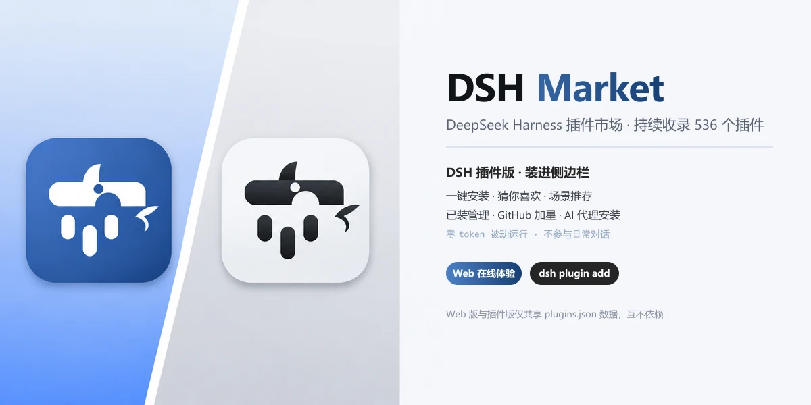

<p align="center">
  <b>中文</b> · <b><a href="./README.en.md">English</a></b>
</p>

<p align="center">
  
</p>

<div align="center">

[](https://dsh.market/)
[](https://github.com/2BingLing/dsh-market/issues/new?template=submit_plugin.md)
[](https://github.com/2BingLing/dsh-market/blob/master/LICENSE)
[](https://dsh.market/)
[](https://github.com/2BingLing/dsh-market/actions)

</div>

---

## 两种形态

<p align="center">
  
</p>

DSH 生态增长极快，插件散落在 GitHub 各处 —— **不知道哪个好用、怎么装**。DSH Market 用一个平台收齐它们，并提供两种消费入口：

| |  **Web 版**（已上线） |  **DSH 插件版**（开发完成） |
|---|---|---|
| **位置** | 浏览器 · GitHub Pages 纯静态站 | DSH 侧边栏 · cordis 插件 |
| **定位** | 发现与评估 | 安装与管理 |
| **核心能力** | 中文搜索 · 五维评分雷达图 · 精选/最新分区 · 冷启动问卷 · 详情页安装命令 | 5-Tab 面板 · 一键安装 · 新手推荐 · 个性化推荐 · 场景推荐 · AI 代理安装（详见 [DSH 插件版](#dsh-插件版)） |
| **安装** | 零安装，浏览器打开即用 | `dsh plugin --profile web add dsh-market` |
| **资源消耗** | — | 零 token 被动运行，不参与日常对话 |

> **两者的关系：仅共享同一份 `plugins.json` 数据**（每日 06:00 自动刷新星星与描述），除此之外没有直接关联——Web 版是独立的浏览站，插件版是独立的 cordis 插件，可分别使用、互不依赖：**用 Web 版不一定要装插件，装插件也不影响 Web 站**。

## 演示

| Web 版 | DSH 插件版 |
|---|---|
|  |  |

## 快速开始

### Web 版

无需安装，直接访问：

<https://dsh.market/>

### 安装插件版

```bash
dsh plugin --profile web add dsh-market
```

装完**重启 harness**，侧边栏底部出现「插件市场」入口。

## DSH 插件版

装进 DSH 侧边栏的插件市场：**新手 3 分钟上手，越用越懂你**。

**新手友好 · 零门槛**

- 首次打开有**冷启动问卷**：选你常用的场景与插件类型，立即得到精选 + 猜你喜欢
- 不用记任何命令——卡片上**一键安装**（skill / cordis 自动路由，失败自动重试、可回滚）
- **零 token 被动运行**：不打开面板不消耗任何资源，不参与日常对话

**个性化推荐 · 越用越懂你**

- 画像来自问卷 / 收藏 / GitHub 加星 / 已装插件，**全部保存在本机**
- 「猜你喜欢」随使用动态更新（EMA 衰减），每个推荐附一句「为什么推荐」

**场景推荐 · 读当前会话**

- 手动触发，读取当前会话标题与消息（**零 token**）→ 推荐"现在这个场景该装什么"

**AI 语义搜索 · 即将上线**

- 本地召回 60 候选 → LLM 精排 20 并附理由；候选池固定不随插件量增长，默认关闭省 token

**AI 代理安装**

- 拿不准装不装？交给 DSH 子代理：读 README → 验证 → 安装，需要配置时先向你确认

## 特性

- **持续收录** — 每天自动扫描 `dsh-plugin` / `dsh` 等 GitHub topic、社区精选列表，全量收录（当前 575 个）
- **实用五维评分** — 维护活跃 / 实用度 / 生态热度 / 便捷度 / 信号质量，加权几何平均融合，每个插件附「为什么推荐」解释
- **中文体验** — 所有插件自动生成中文简介与中文功能标签，中文搜索、中文筛选
- **一键安装** — 插件版确定性脚本路由：skill 型 `git clone`，cordis 型 `dsh plugin add`；失败可重试、可回滚
- **AI 安装** — 插件版可交给 DSH 子代理读 README 验证后安装，需要配置时先向你确认
- **推荐体系** — 冷启动问卷 / 新手友好 / 猜你喜欢（个性化画像）/ 场景推荐（读会话上下文，详见 [DSH 插件版](#dsh-插件版)）
- **零 token 常驻** — 插件版纯被动运行，不打开面板不消耗任何资源

## 使用

### Web 版

| 场景 | 怎么用 |
|---|---|
| 找插件 | 搜索框中文关键词 / 标签多选 / 类型与评分筛选 |
| 看质量 | 卡片五边形雷达图 + 五维明细 + 推荐理由 |
| 装插件 | 详情页复制真实安装命令，或复制「AI 安装提示词」 |

### 插件版（5-Tab 面板）

| Tab | 做什么 |
|---|---|
| 推荐 | 猜你喜欢 / 精选 / 场景推荐（手动触发，读会话上下文） |
| 搜索 | 本地 Fuse 搜索 · 热门标签 · 200+ 结果分页 |
| 收藏 | 星标收藏的插件，稍后安装 |
| 已装 | 检测本机已装（skill 目录 + profile），一键卸载 |
| 设置 | GitHub 绑定（PAT 加星 / 设备流只读）· 推荐模式 · 目标 profile |

## 评分体系

实用五维（权重加权几何平均，借鉴 StarRadar 融合机制、理念转向「实用、便捷」）：

| 维度 | 权重 | 含义 |
|---|---|---|
| 维护活跃 | 30% | 近 90 天提交 + issue 健康度（DSH 迭代快，易坏的插件权重最高） |
| 实用度 | 25% | README / 文档 / 示例完备度 |
| 生态热度 | 20% | stars 对数归一化（p99 动态基准）+ fork 参与率（Wilson 小样本稳健） |
| 便捷度 | 15% | 安装步骤清晰 + 无需额外配置 |
| 信号质量 | 10% | license / topics / description / README 完备度 |

每个插件附 `explanation`（一句话解释评分理由）。详见 [评分体系说明](https://dsh.market/)。

## 数据管道

<p align="center">
  
</p>

```text
GitHub Actions（每日 06:00 自动收录 + 部署）
  └─ collector（Node，并发 10，24h 缓存）
       ├─ 扫描：dsh-plugin / dsh topic + awesome 列表 + dsh-external 组织
       ├─ 特征检测：SKILL.md / skills 目录 / cordis package.json
       ├─ 元数据 + README：GitHub API（stars / 描述 / 安装命令解析）
       ├─ 实用五维评分 + 解释层
       └─ DeepSeek 增量中文化（只翻译新插件，省 API 费用）
            → data/plugins.json
                 ├─ 同步到 web/public/plugins.json（Web 站 + 插件版共用）
                 └─ 提交 → 构建 → 部署 GitHub Pages
```

## 目录结构

```text
├─ collector/   # 数据管道（Node + tsx）：扫描 → 检测 → 评分 → 中文化
├─ web/         # Web 站（Vite + React + TS + Fuse.js）
├─ plugin/
│  ├─ core/     # 插件核心层（纯 Node，零 DSH 依赖，可独立测试）
│  └─ ui/       # 插件 UI 层（cordis Host RPC + 浏览器 Client 面板）
├─ schema/      # 共享类型（DshPlugin / MarketData / PracticalScore）
└─ scripts/     # 工具脚本（截图 / 数据注入 / 视觉评审）
```

## 本地开发

```bash
# 克隆与安装
git clone https://github.com/2BingLing/dsh-market.git
cd dsh-market
npm install
cp .env.example .env        # 填入 GITHUB_TOKEN（必需）、DEEPSEEK_API_KEY（可选）

# 数据管道（扫描 → 检测 → 评分 → 中文化 → data/plugins.json）
npm run collect

# Web 站
npm run dev -w web          # http://localhost:5173
npm run build -w web        # 生产构建

# 插件端
npm run build -w @dsh-market/core    # 核心层
npm run build -w @dsh-market/plugin  # 插件包（lib/index.js + lib/client.js）
```

## 贡献

- **提交插件**：通过 [issue 模板](https://github.com/2BingLing/dsh-market/issues/new?template=submit_plugin.md) 提交，每日管道自动收录
- **修正数据**：评分 / 描述 / 安装命令有误，提 issue 或 PR
- **挂收录徽章**：被收录的插件作者可在 README 顶部挂 [DSH Market 徽章](./PLUGIN-BADGE.md)（已收录 / 高分精选两档）

## 路线图

- [x] M1 数据管道（收录 / 五维评分 / 缓存）
- [x] M2 Web 站（首页 / 详情 / 收藏 / 评分体系页）
- [x] M3 中文化（DeepSeek 批量生成中文简介与标签）
- [x] 发现体系（分区 / 问卷 / 标签面板 / 多维筛选）
- [x] M5 部署（Pages + 每日自动收录）
- [x] M4 DSH 插件端（cordis 侧边栏 + 一键安装）
- [ ] 语义搜索（LLM 选品精排，候选 60 → 精排 20，省 token 设计）
- [ ] 国内镜像（Vercel / Gitee Pages）

## License

[MIT](https://github.com/2BingLing/dsh-market/blob/master/LICENSE)
